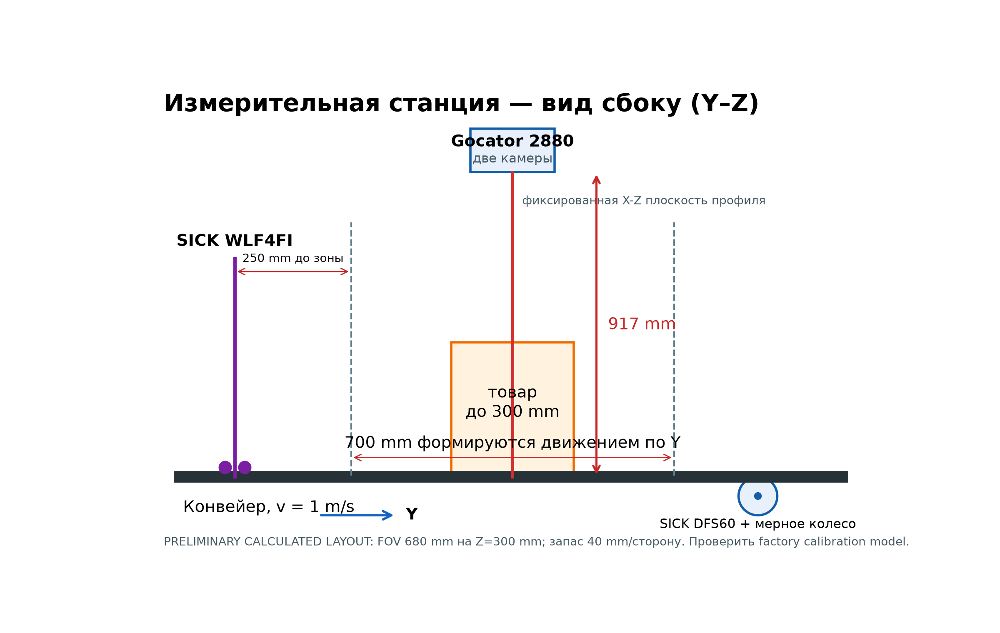
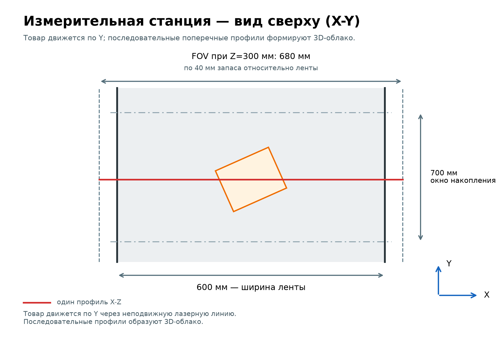
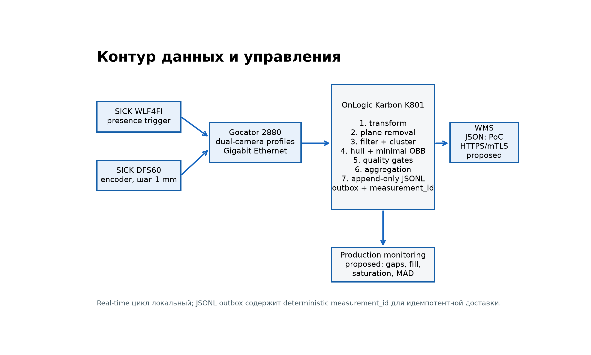
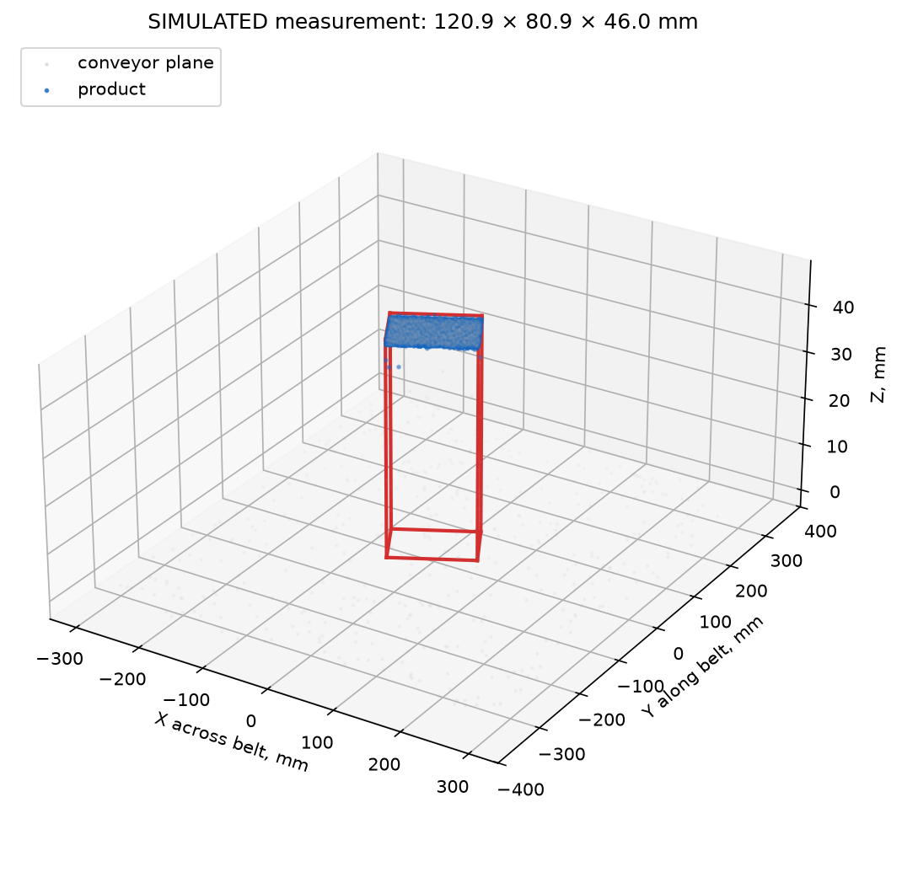

# Программно-аппаратный комплекс измерения габаритов товара на конвейере

**Тестовое задание Ozon Tech × Университет Иннополис**

**Трек «Компьютерное зрение»**

**Вариант 1**

**Выполнил:**

**Болбачан Леонид Анатольевич**

**2026**

**Дата:** 10 сентября 2026 года

**Статус:** инженерный проект и синтетический proof of concept

**Предлагаемая архитектура станции:** 1× LMI Gocator 2880, encoder-triggered, локальный edge

> Главный вывод. Для ленты шириной 600 мм и товара высотой до 300 мм технически
> сильнейшим вариантом является один двухкамерный Gocator 2880. Предварительный
> расчёт даёт 680 мм FOV на высоте 300 мм: запас 40 мм с каждой стороны,
> около 12,7 поперечных отсчёта и ≈10 профилей при целевых 1000 profiles/s на минимальный объект
> 10×10 мм. Последнее требует проверки 1000 Гц в Emulator или на датчике.
> Архитектура покрывает ленту во всём Z-диапазоне и уменьшает тени двумя
> встроенными камерами. Два Gocator 2490 не требуются: один 2490 дискретизирует
> 10 мм ещё лучше, но имеет одну камеру и избыточный MR, а пара повышает цену и
> сложность калибровки без устранения проблем прозрачной упаковки.

## 1. Резюме решения

Цель станции — оценить три стороны минимального по объёму охватывающего
прямоугольного параллелепипеда. Координата X идёт поперёк ленты, Y — по движению, Z — вверх от
плоскости ленты. Товар обнаруживает ретрорефлекторный датчик SICK WLF4FI. Инкрементальный
энкодер SICK DFS60 с мерным колесом должен подавать аппаратные импульсы с целевым
шагом 1 мм после проверки допустимой частоты профилей.
Gocator 2880 объединяет два взгляда на одну лазерную линию и передаёт метрические
профили по Gigabit Ethernet. OnLogic Karbon K801 локально выполняет калибровочное
преобразование, удаление ленты, фильтрацию, объединение профилей, оценку
minimum-volume OBB (minimal-approx),
контроль качества и доставку JSON в WMS.

В основном сценарии ML не требуется: между товарами около 3 с, а входной триггер
и геометрическое отделение от плоскости дают естественную сегментацию. ML предлагается
как отдельный fallback, если пилот обнаружит перекрытия, руки оператора, свисающую
упаковку или сложный динамический фон.

Числа в документе разделены по происхождению:

- **MANUFACTURER SPECIFICATION** — официальная документация производителя;
- **CALCULATED** — расчёт из опубликованных спецификаций и геометрии задачи;
- **SIMULATED** — результат запуска данного прототипа;
- **ESTIMATED** — инженерная оценка, которую надо подтвердить испытанием;
- **MEASURED** — зарезервировано для физического пилота; таких данных в проекте нет.

## 2. Требования и критерии приёмки

Исходный PDF [1] задаёт ленту 600 мм, скорость 1 м/с, средний интервал между
товарами 3 с, диапазон от 10×10×10 до 400×300×300 мм и погрешность каждой стороны
`±max(5 %, 5 mm)`. Форма и внешний вид произвольны. Результат передаётся в WMS.

| Параметр | Требование | Проверка проекта |
|---|---:|---|
| Ширина ленты | 600 мм | FOV 680 мм на Z=300 мм; запас 40 мм/сторону |
| Скорость | 1000 мм/с | целевой encoder spacing 1 мм; 1000 profiles/s требуют проверки |
| Поток | примерно 1 товар / 3 с | локальный цикл, очередь WMS вне измерительного пути |
| Минимум | 10×10×10 мм | ≈10 профилей по Y при целевых 1000 profiles/s и ≈12,7 samples по X |
| Максимум | 400×300×300 мм | MR=800 мм и зона Y=700 мм |
| Допуск | ±max(5%, 5 мм) | расчёт отдельно по каждой сортированной стороне |
| Геометрия | minimum-volume box | оценка minimum-volume OBB (minimal-approx) |
| Интеграция | WMS | PoC: JSON и локальная append-only JSONL outbox |

Для стороны 10 мм допустимо ±5 мм; для 100 мм — также ±5 мм; для 400 мм — ±20 мм.
Начальный инженерный ориентир может быть строже внешнего допуска, чтобы оставить
запас на дрейф, оптику, движение и алгоритм. Конкретный p95 не задан в исходном
задании и должен быть согласован с бизнесом после физического пилота.

## 3. Почему 2× Gocator 2490 не зафиксированы заранее

В preliminary proposal две головы 2490 могли казаться безопасным выбором из-за
широкого FOV. Однако технический выбор должен учитывать не только число в строке
XYZ resolution. У 2490 широкий диапазон меняет локальный pitch с расстоянием,
одна камера создаёт тень, а два независимых сенсора требуют временной синхронизации,
общей координатной системы, overlap stitching и контроля взаимного дрейфа.

Расчёт показывает важный контринтуитивный результат: очень широкий FOV 2490
**не лишает его sampling margin**. При требуемой геометрии у ленты получается
примерно 0,519 мм на точку, то есть около 19,3 отсчёта на 10 мм. Причина — 1920
точек в профиле [5]. Поэтому 2490 отклоняется не из-за недостаточной дискретизации,
а из-за одной камеры, избыточного MR=1525 мм, большей линейности в миллиметрах
и отсутствия необходимости покупать вторую голову.

## 4. Аппаратный trade study

### 4.1 Правила сравнения

Resolution, repeatability, linearity и absolute accuracy не взаимозаменяемы.
Resolution описывает дискретизацию/минимальный шаг данных; repeatability — разброс
повторов; linearity — отклонение усреднённой Z-позиции по MR. Ни один рассмотренный
datasheet LMI не публикует гарантированную абсолютную погрешность готовых L/W/H
после монтажа, движения, сшивки данных и алгоритма. Следовательно, соответствие
допуску нельзя доказать одной строкой datasheet: необходимы калибровочные объекты
с известными размерами и Gage R&R.

Для профилометра при скорости `v=1000 mm/s` продольный шаг равен
`ΔY = v / f_profile`. При 1000/800/500/380 Гц это соответственно
1,0/1,25/2,0/2,63 мм. Смаз равен `v × exposure`: при 1 мс — 1 мм. Scan rate не равен времени
экспозиции; последнюю надо подобрать на реальных тёмных и блестящих SKU.

### 4.2 Gocator 2880 — один dual-camera profiler

**MANUFACTURER SPECIFICATION.** Актуальная официальная страница LMI описывает
2880 как двухкамерный laser line profiler с 1280 точками на профиль [3]. Datasheet
rev. 2.3 даёт FOV 390–1260 мм, X resolution 0,375–1,1 мм, Z resolution
0,092–0,488 мм, MR 800 мм, clearance 350 мм, Z linearity ±0,04% MR, scan rate
380–5000 Гц, encoder и trigger inputs, Gigabit Ethernet [4]. Отдельная repeatability
в этом datasheet не приведена.

**CALCULATED.** Линейная интерполяция FOV по factory range используется только
для предварительной компоновки:

`FOV(z)=390+(1260−390)×z/800`.

Для 40 мм бокового запаса принят FOV 680 мм на верхней поверхности товара.
`z_top≈266,67 мм`. Центр сенсора находится на
`350+266,67+300≈916,67 мм` над лентой. Плоскость ленты лежит на
`z≈566,67 мм`, где FOV≈1006,25 мм. Худший X pitch
`1006,25/1280≈0,786 мм`, то есть 10 мм занимают ≈12,72 отсчёта. На вершине
pitch≈0,531 мм. При целевом 1 мм encoder spacing имеется около 10 профилей вдоль
10-мм объекта. MR оставляет около 233,33 мм после уровня ленты. Z linearity
±0,04%×800 = ±0,32 мм — это linearity, не абсолютная accuracy.

1000 profiles/s — **TARGET**, а не VERIFIED CONFIGURATION. Официальные материалы
LMI объясняют, что максимальная частота зависит от active area, exposure и
subsampling, рассчитывается Trigger panel, а слишком частые encoder triggers
приводят к trigger drop [26–29]. Official desktop Emulator потребовал LMI account
и Windows package; на текущем macOS ARM host его расчёт честно не получен.

| Частота | Шаг Y | Профилей на 10 мм | Вывод для min SKU |
|---:|---:|---:|---|
| 1000 Гц | 1,00 мм | 10 | целевой хороший запас; требует Emulator/hardware check |
| 800 Гц | 1,25 мм | 8 | рабочий запас сохраняется |
| 500 Гц | 2,00 мм | 5 | погранично для устойчивых границ |
| 380 Гц | 2,63 мм | 3,8 | запас недостаточен для уверенного измерения |

До одобрения оборудования надо зафиксировать окончательные ROI/exposure и
подтвердить 1000 Гц в Gocator Emulator либо на физическом 2880. Если режим не
достижим, следует сначала проверить 800 Гц физически, а не молча сохранять шаг 1 мм.

Две внутренние камеры видят одну лазерную линию с противоположных сторон и
уменьшают self-occlusion от вертикальных стенок. Один корпус исключает внешнюю
временную синхронизацию и inter-head calibration. Верхняя система всё равно не
видит дно и глубокие поднутрения.

### 4.3 Gocator 2490 — одна или две головы

**MANUFACTURER SPECIFICATION.** Для 2490 опубликованы 1920 точек/профиль,
FOV 390–2000 мм, X resolution 0,25–1,1 мм, clearance 350 мм, MR 1525 мм,
Z linearity ±0,04% MR, repeatability 0,012 мм и 370 Гц на полном поле;
официальная продуктовая страница отдельно приводит 800 Гц для области 1×2 м
и до 5000 Гц [5, 6]. В используемом англоязычном datasheet отдельная строка
Z resolution не приведена; официальный японский datasheet LMI указывает
Z resolution 0,06–1,5 мм [30].

**CALCULATED.** Для FOV=680 мм на Z=300 мм `z_top≈274,69 мм`; высота
≈924,69 мм. На ленте FOV≈996,72 мм, pitch≈0,519 мм и ≈19,26 отсчёта
на 10 мм. При 800 Гц
продольный шаг 1,25 мм, около восьми профилей на 10 мм. MR покрывает 300 мм с
большим избытком. Z linearity в абсолютных единицах равна ±0,61 мм, тогда как
repeatability 0,012 мм; эти значения нельзя складывать или выдавать за accuracy.

Одна голова имеет один camera view и выраженную тень. Две противоположные головы
уменьшают её, но требуют Sensor Networking/Master, синхронизацию до 1 мкс,
encoder distribution и внешнюю калибровку [9]. Цена и число отказных точек примерно
удваиваются; прозрачность остаётся проблемой. Поэтому 1×2490 — сильный запасной
вариант, а 2×2490 для данной геометрии неоправданны.

### 4.4 Три Gocator 2450 — узкое поле

**MANUFACTURER SPECIFICATION.** Gocator 2450 имеет 1800 точек/профиль,
FOV 145–425 мм, X resolution 0,10–0,255 мм, clearance 270 мм, MR 550 мм,
Z linearity ±0,01% MR, repeatability 0,002 мм и до 5000 Гц [7, 8].

**CALCULATED.** Одна голова не покрывает 600 мм. Двух также недостаточно:
чтобы плоскость ленты оставалась в MR при высоте товара 300 мм, верхний срез
можно поставить не дальше 250 мм в MR; там FOV≈272 мм, две головы дадут ≈545 мм
даже без overlap. Практически нужны минимум три головы, каждой около 220 мм
полезного поля с перекрытием. Sampling >39 отсчётов на 10 мм, linearity
±0,055 мм — существенно лучше нужного, но stitching трёх систем, направленные
тени и высокая цена не окупаются допуском 5 мм.

### 4.5 Две RealSense D457 — active stereo

**MANUFACTURER SPECIFICATION.** D457 имеет global shutter, 1280×720 depth,
до 90 fps, FOV 87°×58°, ideal range 0,6–6 м, minimum depth 0,52 м и заявленную
depth accuracy <2% на 4 м [11]. Производитель документирует аппаратную
синхронизацию нескольких D457 и особенности overlapping depth cameras [12, 13].

**CALCULATED/ESTIMATED.** На 0,8 м поле по горизонтали ≈1518 мм, то есть
≈1,19 мм/pixel и ≈8,4 pixels на 10 мм. При 90 fps объект проходит 11,1 мм между
кадрами; нужна точная фаза триггера, а для min-size нет продольной избыточности.
Две диагональные камеры сокращают слепые зоны, но требуют stereo-depth fusion.
Опубликованная характеристика <2% на 4 м не является гарантией ≤5 мм для всей
измерительной станции в нашем рабочем диапазоне. Поэтому соответствие требованию
`±max(5%, 5 мм)` нельзя доказать по публичной спецификации D457. Active stereo
чувствительна к слабой/повторяющейся текстуре, внешнему IR, чёрным, бликующим и
прозрачным поверхностям. Вариант пригоден для недорогого лабораторного PoC, но не выбран.

### 4.6 Сводная матрица

| Вариант | Coverage 600×300 | Samples на 10 мм X/Y | Occlusion | Интеграция | Cost class | Запас к допуску |
|---|---|---:|---|---|---|---|
| 1× Gocator 2880 | 680 мм сверху, запас 40 мм/сторону | ≈12,72 / 10 | две камеры уменьшают тень | средняя | высокая | хороший, MSA обязателен |
| 1× Gocator 2490 | 680 мм сверху | ≈19,26 / 8 при 800 Гц | одна камера | средняя | высокая | хороший, MR избыточен |
| 2× Gocator 2490 | да | ≈19,26 / 8 на голову | встречные виды | высокая | очень высокая | высокий, но лишняя сложность |
| 3× Gocator 2450 | да с overlap | >39 / 10 | три направленных вида | очень высокая | очень высокая | чрезмерный |
| 2× RealSense D457 | геометрически да | ≈8 px / <1 кадра | два вида | высокая | низкая/средняя | официально не доказан |

Черная матовая поверхность уменьшает возврат, глянцевая даёт saturation и
specular dropout, прозрачная может вернуть фон или несколько поверхностей. У 2880
две камеры повышают вероятность валидного отражения, но не решают физику материала.
Для production нужны настройки экспозиции, ограничения мощности, матовый фон ленты
и мониторинг fill rate; прозрачный товар при недостаточной полноте отправляется
на ручной поток.

### 4.7 Официальное применение 2880 для упаковки

2880 выбран не «вопреки» wood datasheet. Официальный launch LMI относит его к
packaging и крупным сложным формам, подчёркивая две камеры для уменьшения
окклюзий [23]. В официальном кейсе Box Void Fill Measurement Gocator 2880
измеряет внутренний объём высоких коробок; два взгляда помогают видеть зоны,
которые закрывались бы одной камерой [24, 25]. Для задания важны те же физические
свойства: dual-camera triangulation, FOV, MR, scan-rate capability,
encoder/trigger, Ethernet и spatial sampling. Gocator 2490 имеет ещё более прямое
logistics-позиционирование и остаётся допустимым fallback, но его единственная
камера сильнее затеняет произвольную форму.

## 5. Финальная физическая компоновка

Все координаты этого раздела — **PRELIMINARY CALCULATED LAYOUT**. 680 мм FOV на
верхнем уровне оставляет 40 мм запаса с каждой стороны 600-мм ленты. Заводская
модель конкретного датчика и механические допуски должны уточнить координаты.



Сенсор предлагается установить по центру поперечной балки примерно в 916,7 мм над верхней
поверхностью ленты; лазерная линия ориентирована вдоль X. Товар движется по Y.
Расчётная measurement zone длиной 700 мм включает максимальные 400 мм товара и
запас до/после. WLF4FI стоит за 250 мм до начала зоны: при 1 м/с это 250 мс на
создание контекста item_id, проверку health и подготовку буфера. DFS60 контактирует
с лентой мерным колесом; конкретный диаметр выбирается так, чтобы целочисленное
деление импульсов дало 1 мм и не превысило 820 кГц [14].



Кожух исключает доступ к лучу класса 3R и паразитную засветку; interlock отключает
лазер при открытии. Механика должна иметь жёсткую базу, anti-vibration mounting,
защиту окна и сервисный доступ. Финальные 916,7 мм нельзя переносить на монтаж без
factory calibration model: формула использует линейную интерполяцию крайних FOV.

Калибровка включает: (1) заводскую модель профиля; (2) rigid transform sensor→belt;
(3) плоскость Z=0 по калибровочной плите; (4) encoder scale и направление; (5) latency
trigger→profile; (6) проверку по сертифицированным блокам в центре и краях FOV.

## 6. Вычислитель и интерфейсы

Предлагаемая конфигурация OnLogic Karbon K801: индустриальный fanless edge PC с
Core i5-class 35 W CPU, 32 GB RAM, 1 TB NVMe и двумя 2.5GbE [17]. Платформа
конфигурируемая; эти память и накопитель — проектная комплектация, а не единственный
заводской вариант. Один порт выделяется сенсору, второй —
OT/WMS сети; питание и watchdog интегрируются со шкафом. В CPU-контуре на один
товар требуется лишь convex hull нескольких тысяч точек и перебор ориентаций;
GPU не является зависимостью.

Альтернативы: компактный обычный x86 дешевле, но хуже по температуре, вибрации
и жизненному циклу; Jetson полезен при обязательной instance segmentation, но
увеличивает число программных зависимостей; cloud исключён из измерительного
контура из-за сети, задержки и потери управления при сбое. Облако допустимо для агрегированных
метрик и переобучения.



## 7. Алгоритм рабочей станции

1. WLF4FI создаёт событие товара и связывает его с `item_id` от PLC/WMS.
2. DFS60 должен аппаратно задавать Y каждой лазерной линии с целевым шагом 1 мм;
   режим разрешается только после проверки доступной частоты и trigger-drop.
3. Gocator 2880 формирует метрические X-Z профили из двух камер.
4. Factory model и extrinsic transform переводят точки в belt coordinates.
5. Плоскость ленты оценивается при пустой ленте и контролируется RANSAC/health.
6. Точки ниже minimum height удаляются; выбросы фильтруются по соседям.
7. Радиус связи берётся из 90-го процентиля наблюдаемого nearest-neighbour spacing,
   умноженного на 3 и ограниченного 2…20 мм. Ground truth здесь недоступен.
   Мелкие шумовые компоненты отбрасываются; близкие dropout-фрагменты соединяются;
   два кластера размером не менее 20% крупнейшего дают `object_overlap`.
8. Профили объединяются по encoder Y. В PoC контролируются число точек, структура
   кластеров, FOV/range и расхождение OBB-оценок. Мониторинг пропусков профилей,
   fill rate и saturation предлагается для production, но в PoC не реализован.
9. Строится оценка minimum-volume OBB (minimal-approx): устойчивое направление
   оценивается по dominant top plane, hull-based face/edge OBB служит
   fallback/reference; их расхождение используется quality gate.
10. Размеры сортируются `L≥W≥H`, проверяются диапазон и некалиброванный
    эвристический quality score.
11. В PoC валидные окна агрегируются медианой. MAD/inter-window consistency gate,
    минимум валидных окон и repeatability threshold оставлены для будущей валидации.
12. PoC сохраняет сообщение в локальной append-only JSONL outbox; ограниченная
    durable очередь, ACK и retry относятся к предложению для production.

Псевдокод:

```text
on item_trigger(item_id):
    profiles = collect_until_trailing_gap(verified_encoder_step)
    cloud = calibrate_and_merge(profiles)
    plane = validate_belt_plane(cloud)
    components = observed_density_clusters(filter(remove_plane(cloud, plane)))
    if two_significant_components(components): emit(object_overlap, no dimensions)
    object = one_significant_component(components)
    if quality_failed(object): emit(status, no trusted dimensions)
    else:
        object += project_lowest_contact_band_to_plane(object)
        hull = convex_hull(object)
        box = dominant_top_plane_obb_or_face_edge_fallback(hull)
        if obb_disagreement(box, face_edge_obb(hull)) > 25%: emit(low_confidence)
        result = median(valid_window_boxes)
        deliver_or_enqueue(wms_message(item_id, result))
```

## 8. Почему оценка minimum-volume OBB (minimal-approx), а не AABB или PCA OBB

AABB привязан к осям конвейера: поворот прямоугольной коробки на 45° увеличивает
X/Y envelope. PCA находит направления максимальной дисперсии, но не минимизирует
объём; он нестабилен у симметричных и неполных поверхностей. Требование задания —
минимальный охватывающий прямоугольный параллелепипед.

Основной путь устойчиво оценивает ориентацию по доминирующей верхней плоскости и
minimum-area footprint внутри неё. Независимый `scipy.spatial.ConvexHull` [20]
face/edge minimal-approx OBB используется как fallback/reference и quality signal:
для граней и рёбер перебираются ортонормированные frames и выбирается наименьший
из найденных объёмов. Ни один из этих путей не заявлен как точный глобальный
minimum-volume OBB для любого многогранника.

Optional reference фактически проверен с Open3D 0.19.0. В этой замороженной версии
нет `MethodOBBCreate`, поэтому `MINIMAL_JYLANKI` недоступен. Стабильный
`create_from_points_minimal` сам является minimal-approx и не служит точной нижней
границей. Сравнение охватывает axis-aligned box, rotated box, L-призму, цилиндр,
связный невыпуклый composite и отдельный convex irregular fixture. JSON сохраняет
AABB/PCA/custom/reference объёмы, отсортированные размеры и покоординатные
расхождения. Называть результат Open3D 0.19 Jylänki нельзя [18, 22].

`Estimated support-contact completion` — явная эвристика: на плоскость проецируется
только нижняя полоса (1-й процентиль), а не весь силуэт. Это помогает box-like
объектам оценить контакт и не раздувает наклонённый силуэт. Эвристика не
восстанавливает произвольное дно; ножки, полости, мягкая упаковка и невыпуклые
поднутрения остаются источником неопределённости.

## 9. Роль ML и план данных

Основной путь детерминирован и объясним. ML активируется лишь если геометрическая
проверка не отличает товар от второго объекта, рук, свободного пакета или движущегося
фона. Рекомендуемый fallback — instance segmentation в синхронном RGB-кадре,
один основной класс `product` и служебные negative labels `person/hand`,
`conveyor_fixture`, `foreign_object`. Маска не измеряет размеры; она лишь выбирает
соответствующие 3D-точки.

Для датасета пилота целевой порядок — 12–15 тыс. размеченных кадров/профильных
проекций: не менее 2 тыс. трудных примеров (чёрный, глянец, прозрачность, тонкие
пакеты, край FOV), 2 тыс. сложных отрицательных примеров и проходы SKU в разных yaw.
Split 70/15/15 делается группами по SKU, дню и линии, чтобы один экземпляр не
утёк между train/test. Augmentation: яркость, шум, blur по ходу, dropout полос,
частичная окклюзия и background replacement; геометрические масштабы не изменяются
без согласованного преобразования depth.

Стартовая модель — компактная YOLOv8m-seg, потому что практический кейс Ozon Tech
описывает переход к YOLOv8m-seg и более 15 тыс. изображений [2]. Это отраслевой
ориентир, не результат данного проекта. Метрики: mask mAP50-95, recall трудного
среза, false merge/split rate и, главное, downstream pass rate размеров. Deployment
через ONNX/TensorRT — только после измерения необходимости; CPU geometry остаётся
авторитетным контуром.

## 10. WMS и эксплуатационная надёжность

JSON содержит `measurement_id`, `item_id`, UTC timestamp, `length_mm`, `width_mm`,
`height_mm`, `confidence`, `measurement_status`. `confidence` — некалиброванный
эвристический quality score, а не вероятность правильности. `measurement_id`
стабилен для пары item/timestamp и используется как idempotency key. Пример:

```json
{
  "measurement_id": "36918523-5216-5204-acbf-cfde7c82fbdc",
  "item_id": "synthetic-demo-001",
  "timestamp": "2026-09-09T12:00:00Z",
  "length_mm": 121.254,
  "width_mm": 81.173,
  "height_mm": 45.915,
  "confidence": 0.905,
  "measurement_status": "ok"
}
```

**Реализовано в PoC:** схема сообщения, детерминированный `measurement_id`, UTC
JSON, локальная append-only JSONL outbox и unit-тесты.

Для любого `measurement_status != "ok"` публичный WMS JSON передаёт
`length_mm = width_mm = height_mm = null`: внутренние диагностические размеры
не представляются как доверенные измерения. ID, item, timestamp, quality score и
status сохраняются.

**Предлагается для production, но не реализовано:** HTTPS POST, mTLS, timeout,
retry worker, ограниченный exponential backoff, ACK, dead-letter policy, лимиты
очереди и TPM/OS keystore. `wms_unavailable` относится к этому transport-слою и
не испускается текущим измерительным PoC.

## 11. Ошибки и защитное поведение

| Сбой | Детектор | Поведение |
|---|---|---|
| нет/мало depth | PoC: число точек / отсутствие кластера | `insufficient_depth_data`, ручной поток |
| два товара | два сопоставимых кластера | `object_overlap`, не объединять размеры |
| объект вне диапазона | OBB/FOV/MR boundary | `measurement_out_of_range` |
| дрейф/вибрация | residual контрольной плоскости | `calibration_error`, останов/перекалибровка |
| плохая повторяемость окон | production: MAD/inter-window gate | предложено, не реализовано в PoC |
| прозрачность/глянец | production: dropout/fill-rate/saturation monitoring | recipe retry или `low_confidence` |
| энкодер проскальзывает | PLC speed disagreement | invalidate item, service alarm |
| WMS недоступна | timeout/5xx | production: bounded outbox, ACK и retry |
| персонал в зоне | light curtain/interlock | отключить лазер/остановить измерение |

| Статус | В PoC | Триггер | Расширение production |
|---|---|---|---|
| `ok` | да | один кластер, эвристический quality score прошёл gate | калибровка confidence по физическому пилоту |
| `insufficient_depth_data` | да | нет измеримого кластера | material recipe/reroute |
| `object_overlap` | да | ≥2 значимых кластера | PLC развод потока |
| `measurement_out_of_range` | да | OBB выше диапазона с допуском | аппаратные FOV/MR gates |
| `low_confidence` | да | <80 точек или OBB disagreement >25% | future: MAD и minimum window count |
| `calibration_error` | частично | PoC: dominant plane не найдена | artefact/health контроль |
| `wms_unavailable` | нет | только будущий transport | retry/ACK/dead letter |

Оптически невидимый выступ, дно и глубокая впадина принципиально не восстанавливаются
надёжно из верхнего вида. Система должна предпочесть отказ ложной точности. Для
постоянного измерения полностью прозрачной упаковки нужен отдельный физический
канал (например, light curtain/multi-view silhouette), новый trade study и новая MSA.

## 12. Прототип и тестирование

Пакет Python 3.12 использует NumPy, SciPy/Qhull/KD-tree, Pydantic,
Matplotlib/Pillow и ReportLab. Open3D — только optional test dependency.

Основной генератор помечен **SIMPLIFIED LINE-PROFILER SYNTHETIC**. Число точек не
задаётся произвольно: шаг X вычисляется из FOV профилометра на номинальной верхней
высоте объекта и 1280 samples/profile; height-dependent FOV затем применяется для
visibility clipping. Шаг Y задаётся как `speed/profile_rate`.
Поверхности преобразуются в координаты ленты; упрощённые два встречных взгляда
оставляют видимые top/side candidates; z-buffer хранит не более одного depth на
ячейку X/Y. Bottom отсутствует. Затем применяются self-shadow, noise, point
dropout, неполная видимость, пропуски целых profile strips и height-dependent FOV
clipping. Модель не воспроизводит реальные BRDF, laser speckle, multipath,
насыщение или преломление прозрачной упаковки и не является Gocator Emulator.
Закрытая шестигранная поверхность используется только в low-level regression fixtures.

Ground truth хранится в evaluator metadata. Измеритель получает только точки и
замороженный `MeasurementConfig`; подмена скрытого эталона защищена тестом и не
меняет runtime output. L-призма, цилиндр и связный невыпуклый composite проходят
полный pipeline.

Результаты разделены; их нельзя объединять в одно число «точности». Контрольные
наборы seed 42: regression — 7/7 correct OK, p95 abs L/W/H
`2,371 / 2,413 / 2,622 мм`; simplified line-profiler — 7/7 correct OK,
`4,675 / 2,570 / 1,311 мм`.

`Acceptance rate=(correct OK+wrong OK)/expected-valid`; `precision among
accepted=correct OK/(correct OK+wrong OK)`; `correct measurement rate=correct
OK/expected-valid`.

| Monte Carlo subset | Total | Exp. valid | Exp. reject | Correct OK | Wrong OK | Rejected valid | Acceptance | Accepted precision | Correct rate |
|---|---:|---:|---:|---:|---:|---:|---:|---:|---:|
| yaw-only | 125 | 125 | 0 | 125 | 0 | 0 | 100,0% | 100,0% | 100,0% |
| tilted/irregular | 125 | 125 | 0 | 90 | 16 | 19 | 84,8% | 84,9% | 72,0% |
| small-object | 125 | 125 | 0 | 123 | 0 | 2 | 98,4% | 100,0% | 98,4% |
| noisy/incomplete | 125 | 100 | 25 | 89 | 11 | 0 | 100,0% | 89,0% | 89,0% |
| **Итого** | **500** | **475** | **25** | **427** | **27** | **21** | **95,6%** | **94,1%** | **89,9%** |

Все 25 expected-reject сценариев отклонены; false accepted — 0. Это проверка
защитной логики на искусственном поднаборе, **не ожидаемая false-ok rate физической
станции**. Порог OBB disagreement выбран только на development seed 1337:

| Development gate | Correct OK | Wrong OK | Reject | Acceptance | Accepted precision | Correct rate |
|---|---:|---:|---:|---:|---:|---:|
| нет | 95 | 30 | 0 | 100,0% | 76,0% | 76,0% |
| disagreement ≤30% | 91 | 27 | 7 | 94,4% | 77,1% | 72,8% |
| **disagreement ≤25%** | **90** | **19** | **16** | **87,2%** | **82,6%** | **72,0%** |
| disagreement ≤20% | 85 | 18 | 22 | 82,4% | 82,5% | 68,0% |
| disagreement ≤10% | 78 | 11 | 36 | 71,2% | 87,6% | 62,4% |

Порог 25% выбран как простой gate без падения correct measurement rate ниже 70%;
цель 95% precision among accepted этим признаком не достигалась без большого числа отказов.
После заморозки tilted/irregular и полный Monte Carlo 500 на final seed 20261017
были запущены по одному разу; после просмотра результата алгоритм не менялся.

До gate tilted/irregular давал 99 correct OK, 25 wrong OK и 1 reject: precision
among accepted 79,8%, correct measurement rate 79,2%. После gate: 90 correct OK,
16 wrong OK и 19 reject/low-confidence; acceptance rate 84,8%, precision among
accepted 84,9%, correct measurement rate 72,0%. P95 abs ошибки
среди 106 принятых status=ok: `15,392 / 12,696 / 2,922 мм`; среди 90 correct OK:
`10,855 / 9,016 / 2,931 мм`. Невидимый нижний extremum и undercuts остаются
видимостью/support-моделью упрощённого симулятора. Это указывает на потенциальную
проблему наблюдаемости, но не доказывает идентичный отказ физического dual-camera
Gocator; второй вид рассматривается только если реальный пилот подтвердит проблему.



На иллюстрации серым показана известная плоскость конвейера, синим — наблюдаемая
поверхность товара, красным — измеренный OBB. Большой пустой диапазон по X/Y нужен,
чтобы показать полный 600-мм conveyor envelope; визуально небольшой объект не
означает нехватку sampling в исходном облаке. Отдельный `multiframe-demo` сохраняет
девять encoder-положений, пять валидных независимых окон, их медиану, итоговый
WMS JSON, PNG и GIF. Тест сверяет поля WMS с фактическим aggregate.

В репозитории также сохранён `sample_scene.npz`, поэтому изображение не является
непроверяемой картинкой: CLI заново измеряет тот же формат и печатает WMS JSON.
Фиксированный seed обеспечивает повторяемость, но физическая приёмка намеренно
не опирается на этот генератор.

> Эти результаты проверяют программную геометрию на симулированных данных. Они не
> устанавливают абсолютную точность физической станции.

## 13. План физической валидации

Этап 0 — laser safety и FAT без товара. Этап 1 — калибровочные блоки 10, 20, 50,
100, 300 и 400 мм в центре и по краям, минимум 30 повторов на позицию. Этап 2 —
MSA/Gage R&R для автоматической станции: повторные проходы в разные дни/смены,
после разных циклов перекалибровки и при разных температурах, X-положениях и yaw;
при наличии нескольких станций добавляется sensor/unit factor. Персонал учитывается
только там, где человек выполняет установку, очистку или калибровку. Отдельно
оцениваются bias, linearity, repeatability и reproducibility. Этап 3 — не менее
1000 SKU по размеру/материалу, по 10 проходов и yaw. Этап 4 — 8-часовой прогон и
проверка поведения при искусственно вызванных сетевых сбоях. Этап 5 — теневой
пилот на реальной линии до согласованного числа товаров.

Главная метрика: доля товаров, где все три стороны проходят
`|measured−reference|≤max(0.05×reference,5 mm)`, с 95% confidence interval.
Вторичные: p50/p95/p99 absolute error по оси; invalid rate по материалу; false-ok
на прозрачных; repeatability; processing p95; WMS delivery p99; availability;
calibration drift. **Предлагаемые начальные цели пилота**, например ≥99,5% pass,
false-ok ≤0,1% и latency p95 <1 с, не являются требованиями Ozon из задания.
Финальные пороги нужно согласовать с бизнесом по стоимости ложного измерения,
ручного отвода и пропускной способности. Их фиксируют до контрольного тестирования
на заранее не просмотренной выборке.

## 14. Производительность и масштабирование

В текущем benchmark объём точек невелик и предназначен для функциональной проверки.
Целевой throughput при ещё не подтверждённых 1000 профилях/с × 1280 samples — до
1,28 млн raw samples/s до invalid-mask и crop. За 700 мм зоны — до 896 тыс. samples.
При 800/500/380 Гц поток пропорционально ниже, но уменьшается продольная полнота.
Поэтому рабочий adapter должен выполнять streaming crop/downsample и передавать
на hull лишь foreground. При товаре раз в 3 с средний бюджет существенно больше
окна съёмки; WMS отправка асинхронна.

Оптимизации по порядку: ROI X/Z в сенсоре, удаление invalid profiles, voxel/grid
downsample с шагом не крупнее 0,5–1 мм для min SKU, incremental clustering,
convex hull только foreground, ограничение числа candidate frames, профилирование.
Уменьшать сетку сильнее 1 мм до отдельного исследования нельзя: можно потерять
реальный 10-мм объект и границу допуска.

## 15. Вывод и решение о следующем этапе

Один Gocator 2880 — минимальная архитектура, которая одновременно покрывает
600×300 мм measurement envelope, даёт достаточную дискретизацию 10-мм объекта,
снимает часть окклюзий двумя камерами и избегает multi-head calibration. Gocator
2490 остаётся технически жизнеспособным single-head fallback, но 2×2490 не являются
обоснованной основой станции. Три 2450 дают ненужную точность ценой интеграции;
две D457 не имеют достаточной опубликованной метрологической гарантии.

Software PoC реализован и воспроизводим. На tilted/irregular acceptance rate
составляет 84,8%, precision among accepted — 84,9%, correct measurement rate —
72,0%. Это visibility/support-model limitation упрощённого симулятора, а не
доказанный предел физического dual-camera Gocator.
Следующий обоснованный этап — физический
пилот после проверки лазерной безопасности, calibration model и MSA/Gage R&R.
Серийное внедрение возможно после контрольного теста ассортимента. Прозрачные и
зеркальные объекты должны оставаться
отдельным контролируемым потоком, пока их false-ok rate не подтверждён.

## Источники

Дата доступа для веб-источников: 10 сентября 2026 года.

1. Ozon Tech × Университет Иннополис. «Тестовое задание, трек Компьютерное зрение,
   вариант 1». Исходный PDF, 2 страницы, предоставлен с заданием.
2. Мария Гафурова, Ozon Tech. «Размер имеет значение. Как Ozon автоматизировал
   измерение товаров на складах», 23.04.2024: https://habr.com/ru/companies/ozontech/articles/809409/
3. LMI Technologies. Gocator 2800 Series: https://lmi3d.com/series/gocator-2800-series/
4. LMI Technologies. Gocator 2880 Dual Camera 3D Smart Profile Sensor Datasheet,
   rev. 2.3: https://lmi3d.com/wp-content/uploads/2024/09/DATASHEET_Gocator_2880_Wood_US.pdf
5. LMI Technologies. Gocator 2490 Datasheet, rev. 1.1:
   https://lmi3d.com/wp-content/uploads/2020-02/DATASHEET_Gocator_2490_US_WEB.pdf
6. LMI Technologies. Gocator 2490 product page:
   https://lmi3d.com/gocator-2490-3d-laser-line-profiler/
7. LMI Technologies. Gocator 2400 Series Datasheet:
   https://lmi3d.com/wp-content/uploads/2024/02/DATASHEET_Gocator_2400_US_WEB-1.pdf
8. LMI Technologies. Gocator 2400 Series: https://lmi3d.com/series/gocator-2400-series/
9. LMI Technologies. Sensor Networking: https://lmi3d.com/technology/networking/
10. LMI Technologies. Accessories: https://lmi3d.com/product-accessories/
11. RealSense. D457 GMSL/FAKRA: https://www.realsenseai.com/products/d457-gmsl-fakra/
12. RealSense. D457 Hardware Synchronization:
    https://dev.realsenseai.com/docs/d457-hardware-synchronization/
13. RealSense. Multiple Depth Cameras Configuration:
    https://dev.realsenseai.com/docs/multiple-depth-cameras-configuration/
14. SICK. DFS60I-BHPC65536 datasheet:
    https://www.sick.com/media/pdf/2/62/762/dataSheet_DFS60I-BHPC65536_1091640_en.pdf
15. SICK. W4F product information:
    https://www.sick.com/media/docs/4/24/724/product_information_w4f_en_im0093724.pdf
16. SICK. WLF4FI-973121A0ZZZ datasheet:
    https://www.sick.com/media/pdf/5/45/645/dataSheet_WLF4FI-973121A0ZZZ_1124155_en.pdf
17. OnLogic. Karbon K801–K804 documentation:
    https://support.onlogic.com/product-documentation/rugged-products/karbon-k800-series/k801-k802-k803-k804
18. Open3D 0.19. OrientedBoundingBox API:
    https://www.open3d.org/docs/release/python_api/open3d.geometry.OrientedBoundingBox.html
19. Open3D 0.19. Point cloud tutorial:
    https://www.open3d.org/docs/release/tutorial/geometry/pointcloud.html
20. SciPy. ConvexHull API:
    https://docs.scipy.org/doc/scipy/reference/generated/scipy.spatial.ConvexHull.html
21. OpenCV. Camera calibration and 3D reconstruction:
    https://docs.opencv.org/4.x/d9/d0c/group__calib3d.html
22. Open3D development API. Tensor OrientedBoundingBox, включая
    `MethodOBBCreate.MINIMAL_JYLANKI`: [официальная документация](https://www.open3d.org/docs/latest/python_api/open3d.t.geometry.OrientedBoundingBox.html)
23. LMI Technologies. Gocator 2880 launch, complex shapes and packaging:
    https://lmi3d.com/news/lmi-technologies-unveils-gocator-2880-the-first-all-in-one-3d-profile-sensor-with-dual-cameras/
24. LMI Technologies. Box Void Fill Measurement with a Gocator 2880:
    https://lmi3d.com/blog/box-void-fill-measurement-with-a-dual-camera-smart-3d-laser-profiler/
25. LMI Technologies. Box Void Fill Walkthrough:
    https://lmi3d.com/wp-content/uploads/2023/03/Box-void-fill-Walkthrough.pdf
26. LMI Technologies. Gocator 2300/2880 Series User Manual:
    https://lmi3d.com/wp-content/uploads/2016-08/15159-4.3.3.167_MANUAL_User_Gocator-2300-2880-Series.pdf
27. LMI Technologies. GoPxL Configuring Acquisition:
    [официальная документация](https://ap.lmi3d.com/manuals/gopxl/gopxl-1.3/LMILaserLineProfiler/Content/WebInterface/Acquire/ConfiguringAcquisition.htm)
28. LMI Technologies Support. Improving Max Frame Rate:
    https://support.lmi3d.com/hc/en-us/articles/360033661791-Improving-Max-Frame-Rate
29. LMI Technologies Support. Trigger Drop warnings in Encoder Trigger mode:
    https://support.lmi3d.com/hc/en-us/articles/360033336991-Trigger-Drop-warnings-in-Encoder-Trigger-mode
30. LMI Technologies. Gocator 2490 Japanese Datasheet, rev. 1.1:
    [официальный PDF](https://lmi3d.com/wp-content/uploads/2020-02/DATASHEET_Gocator_2490_JP_WEB_0.pdf)

## Приложение A. Воспроизведение

```bash
uv sync --frozen --python 3.12
uv run pytest -q
uv run ruff check .
uv run conveyor-dimensioning demo --output-dir assets/demo --seed 42
uv run conveyor-dimensioning benchmark --output-dir assets/demo --seed 42
uv run conveyor-dimensioning sensor-benchmark --output-dir assets/demo --seed 42
uv run conveyor-dimensioning monte-carlo --output-dir assets/demo --count 500 --seed 20261017
uv run conveyor-dimensioning multiframe-demo --output-dir assets/demo --seed 42
uv run conveyor-dimensioning measure assets/demo/sample_scene.npz \
  --item-id synthetic-check --seed 42
uv sync --frozen --python 3.12 --extra open3d
uv run python scripts/compare_obb.py --output assets/demo/obb_comparison.json
uv run python scripts/generate_diagrams.py
uv run python scripts/build_report.py
```

## Приложение B. Граница доказательств

В проекте нет физического Gocator, conveyor rig, calibration artefacts и реального
assortment dataset. Поэтому слова «точность», «pass» и «benchmark» без квалификатора
относятся только к synthetic software test. Ни resolution, ни linearity, ни
repeatability производителя не подменяют absolute station accuracy. Это ограничение
является частью решения: система проектируется с quality statuses и планом MSA,
а не с недоказанной production-гарантией.
